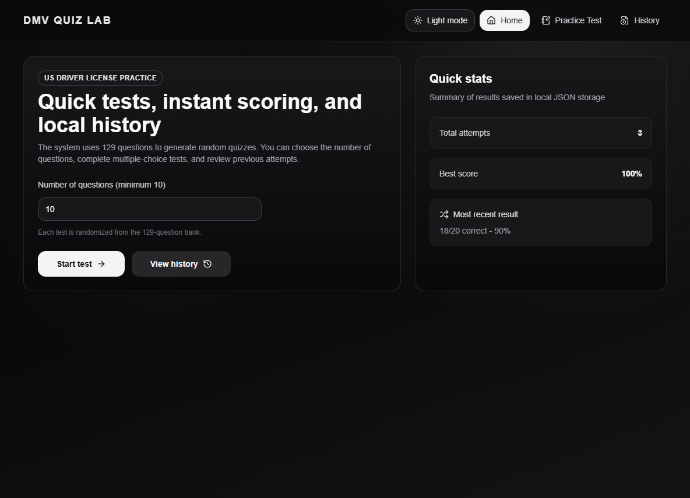
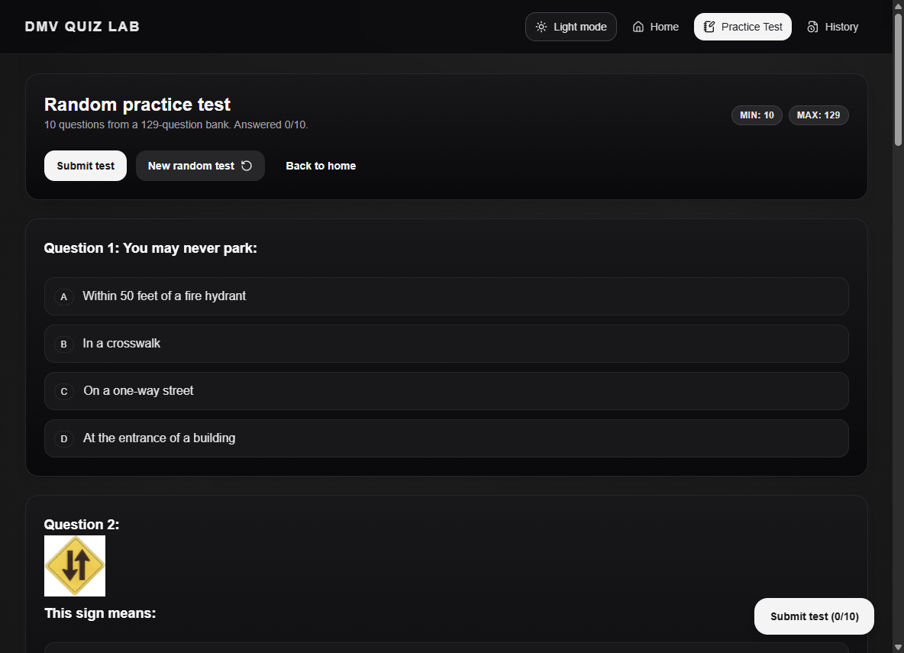
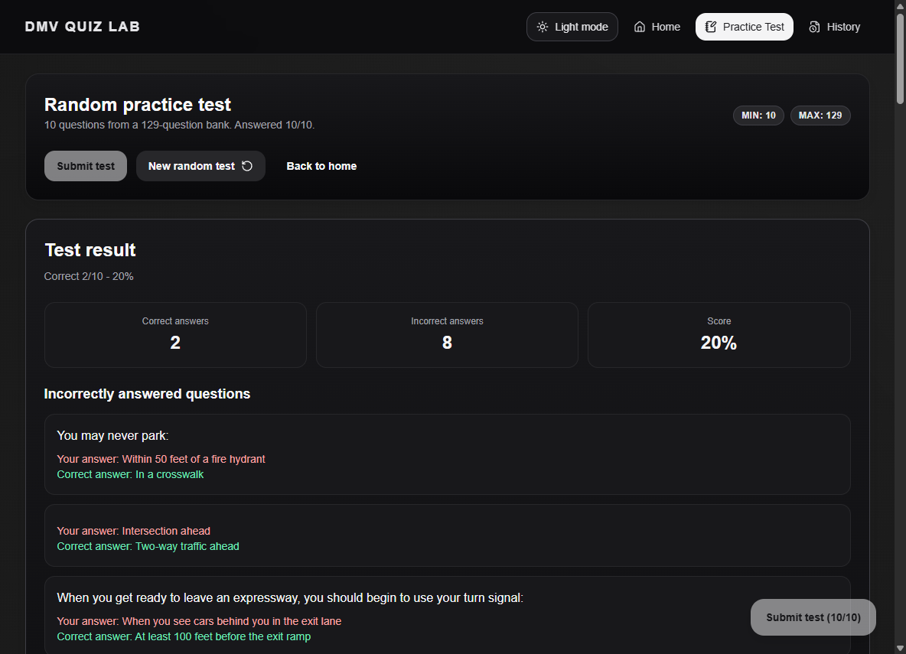
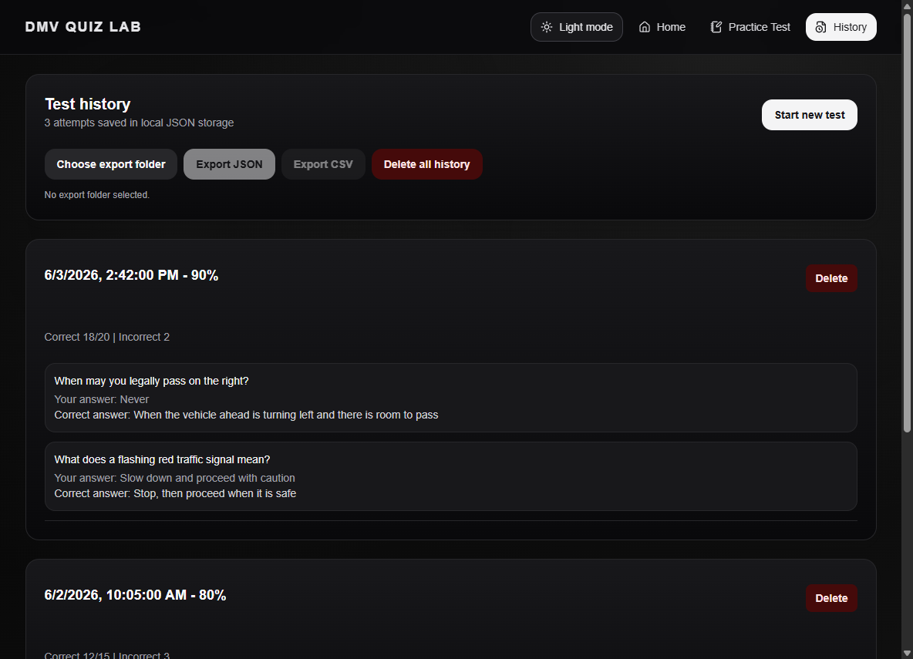

# DMV Quiz Lab

A desktop practice-test app for the **New York State DMV learner's permit knowledge test**. Built with Electron, React, and TypeScript, it generates randomized multiple-choice quizzes from a 129-question bank, scores you instantly, explains every wrong answer, and keeps a local history of every attempt — all offline, with no account and no tracking.

## Screenshots

> All shots are in [docs/screenshots/](docs/screenshots/) and can be regenerated with the script described under [Generating screenshots](#generating-screenshots).

| Home — pick your test & quick stats | Practice test with instant explanations |
| --- | --- |
|  |  |

| Scored result & missed questions | History, export & light theme |
| --- | --- |
|  |  |

## Features

- **129 practice questions** drawn from the eight chapters of the NY Driver's Manual that the real permit exam covers (Chapters 4–11), plus a dedicated **road-sign image set** that shows the actual sign and asks you to identify it.
- **Configurable test length** — choose how many questions you want (minimum 10, up to the full bank) right on the home screen.
- **Random-draw quizzes** — each test is a fresh shuffle of the bank, and the answer options are reshuffled too, so you learn the material rather than the position of the correct answer. Hit **New random test** any time to reshuffle without leaving the page.
- **Instant scoring** — submit to see your correct/incorrect counts and a percentage, with a floating submit button that tracks how many questions you've answered.
- **Per-question explanations** — every question you miss is shown with your answer, the correct answer, and a short explanation of *why*.
- **Local score history** — every attempt is saved to a local JSON file and listed on the History page, including the date, score, and the specific questions you got wrong.
- **Export your history** to **CSV** or **JSON** to a folder of your choice — handy for tracking progress over time or analyzing weak spots in a spreadsheet.
- **Manage your data** — delete a single attempt or clear all history (with a confirmation prompt). Nothing ever leaves your machine.
- **Quick stats on the home screen** — total attempts, best score, and your most recent result at a glance.
- **Dark and light themes** — defaults to your OS preference, toggles with one click, and remembers your choice between sessions.
- **Keyboard- and mouse-friendly UI** with a sticky navbar and a scroll-to-top button for long quizzes.
- **Portable Windows build** — a single `.exe`, no installer, no admin rights, no registry entries. Fully offline.

## Download

Grab the latest portable `.exe` from the [Releases page](https://github.com/tritk0910/DMV-Quiz-Lab/releases) and run it — no installation required. Your quiz history is saved as `quiz-results.json` in the app's user-data folder (under `%APPDATA%` on Windows), separate from the executable, so updating the app never loses your progress.

## How it works

1. **Home** — set the number of questions and press **Start test**. The sidebar shows your total attempts, best score, and most recent result.
2. **Practice Test** — answer each multiple-choice question (options are lettered A–D). The floating button shows your progress; press **Submit test** when you're ready, or **New random test** to draw a fresh set.
3. **Results** — see your score, a breakdown of correct vs. incorrect, and every missed question with the correct answer and an explanation.
4. **History** — review past attempts, choose an export folder, export to CSV/JSON, and delete individual attempts or wipe everything.

All scoring and storage happen locally; the app makes no network requests during use.

## Tech stack

- [Electron](https://www.electronjs.org/) + [electron-vite](https://electron-vite.org/) (main / preload / renderer split)
- [React 19](https://react.dev/) + [React Router 7](https://reactrouter.com/)
- [TypeScript](https://www.typescriptlang.org/)
- [Tailwind CSS](https://tailwindcss.com/) for styling, [lucide-react](https://lucide.dev/) for icons
- [electron-builder](https://www.electron.build/) for packaging

## Project layout

```
src/
  main/         Electron main process — window creation + IPC handlers
                (list / save / delete / clear / export quiz results)
  preload/      Context-bridge API exposed to the renderer (window.api)
  renderer/src/
    pages/      HomePage, QuizPage, HistoryPage
    components/ Layout (navbar + theme toggle), ScrollToTop, ui/ primitives
    data/       Question bank (chapter4–chapter11 + roadSigns) and sign images
    lib/        quiz logic (shuffle, clamp, evaluate) and utility helpers
    types/      Shared TypeScript types
resources/      App icon
.github/        Release workflow (tag-triggered Windows build)
```

### Question bank

| Source | Questions |
| --- | ---: |
| Chapter 4 | 18 |
| Chapter 5 | 16 |
| Chapter 6 | 8 |
| Chapter 7 | 9 |
| Chapter 8 | 12 |
| Chapter 9 | 20 |
| Chapter 10 | 22 |
| Chapter 11 | 8 |
| Road signs (image set) | 16 |
| **Total** | **129** |

## Development

Requires Node.js 22+ and Yarn.

```bash
yarn              # install dependencies
yarn dev          # launch the app with hot reload
yarn typecheck    # run TS type checks (node + web projects)
yarn lint         # ESLint
yarn format       # Prettier + ESLint --fix
```

### Building

```bash
yarn build        # typecheck + bundle with electron-vite
yarn build:win    # build a portable Windows .exe (output in dist/)
yarn build:mac    # build a macOS app
yarn build:linux  # build AppImage / snap / deb
```

Releases are automated: pushing a `v*` tag triggers the [release workflow](.github/workflows/release.yml), which builds the portable Windows `.exe` on `windows-latest` and attaches it to a GitHub Release.

## Generating screenshots

The images in the [Screenshots](#screenshots) section are committed under `docs/screenshots/`. To regenerate them, [scripts/capture-screenshots.cjs](scripts/capture-screenshots.cjs) launches the built app, drives each screen, and writes the four PNGs automatically:

```bash
yarn build                                   # produce out/
ELECTRON_RUN_AS_NODE= node_modules/electron/dist/electron.exe scripts/capture-screenshots.cjs
```

The script seeds a small sample history so the History page and home stats look populated; it doesn't touch your real saved results. Alternatively, run `yarn dev` and capture each window manually (on Windows, `Win + Shift + S`), saving the files as `home.png`, `quiz.png`, `result.png`, and `history.png`.

## Disclaimer

This is an unofficial study tool. Question content is paraphrased from publicly available material in the New York State Driver's Manual (MV-21). Always verify against the [official NY DMV resources](https://dmv.ny.gov/) before your exam.

## License

No license declared yet — all rights reserved by the author.
